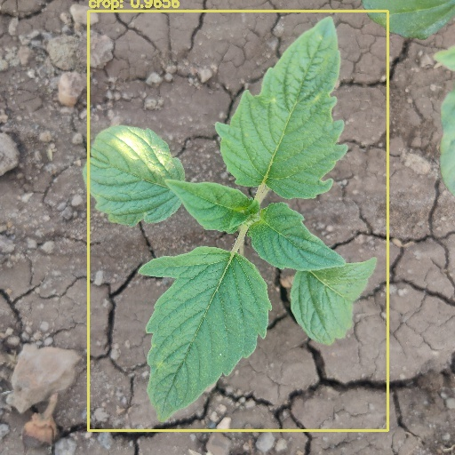

# Weed Detection Robot 🌿

Real-time weed detection system built on Raspberry Pi using YOLOv4 and OpenCV. Detects and classifies crop vs. weed in live camera feed for smart agriculture applications.

## Demo



## How It Works

1. Raspberry Pi camera captures live video feed
2. YOLOv4 model processes each frame
3. Bounding boxes drawn around detected weeds vs. crops
4. Classification result displayed in real time

## Tech Stack


- **YOLOv4** — Object detection model
- **OpenCV** — Image processing & camera interface
- **Raspberry Pi** — Edge deployment hardware

## Project Structure


weed-detection-robot/
├── opencv/
│ ├── weedDetectionFromCamera.py # Live camera detection
│ ├── detection_with_opencv.ipynb # Notebook: training & testing
│ └── detection.jpeg # Sample detection output
└── data/ # Dataset (not tracked — too large)
├── images/ # Training images
├── weights/ # YOLOv4 weights
├── cfg/ # Model config
└── names/ # Class labels (crop, weed)


## Getting Started

```bash
git clone https://github.com/gorap50/weed-detection-robot.git
cd weed-detection-robot
pip install opencv-python
```

Add your trained weights to `data/weights/` then run:

```bash
python opencv/weedDetectionFromCamera.py
```

## Hardware

- Raspberry Pi 4
- Pi Camera Module
- microSD card (32GB+)

## Dataset

Crop and weed images with YOLO-format annotations.
Classes: `crop`, `weed`
